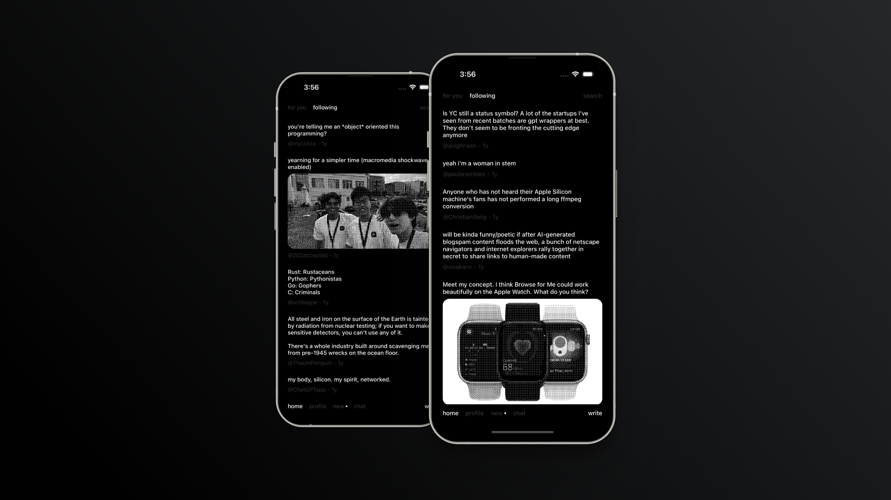

# TextOS

This implements Text OS Concept from https://twitter.com/samdape/status/1762179245697122614 in React Native.

This uses Skia Shader (sksl) to implement bayer dithering.

# References

- [https://surma.dev/things/ditherpunk/](https://surma.dev/things/ditherpunk/)
- [https://github.com/m1guelpf/textos-twitter/](https://github.com/m1guelpf/textos-twitter/)